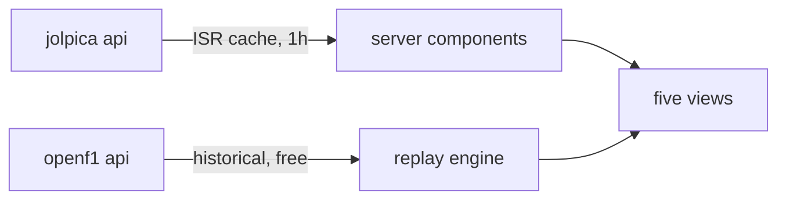

```
 █████╗ ██████╗ ███████╗██╗  ██╗
██╔══██╗██╔══██╗██╔════╝╚██╗██╔╝
███████║██████╔╝█████╗   ╚███╔╝
██╔══██║██╔═══╝ ██╔══╝   ██╔██╗
██║  ██║██║     ███████╗██╔╝ ██╗
╚═╝  ╚═╝╚═╝     ╚══════╝╚═╝  ╚═╝
```
<div align="center">

### `REAL F1 DATA // NONE OF IT INVENTED`

*a 2026-season Formula 1 dashboard that replays real telemetry instead of faking it — [live at apex-livid-kappa.vercel.app](https://apex-livid-kappa.vercel.app)*

    -E10600?style=flat-square&labelColor=111111)

</div>

---

## 🏁 What is this

APEX is a Formula 1 dashboard for the 2026 season: standings, calendar, results, history, and a telemetry view — all pulled live from public APIs, none of it hardcoded. Championship data comes from [Jolpica](https://github.com/jolpica/jolpica-f1) (the Ergast successor) and gets cached server-side so the dashboard never hammers anyone's free tier.

The telemetry view is the part that earns its keep. OpenF1 charges €9.90/month for real-time data but gives away every session since 2023 for free once it's 30 minutes old — so APEX replays history instead: pick any past session and any driver, and watch actual speed, gear, throttle, brake and the running order play back exactly as it happened, with tyre compounds and gaps. Even the circuit map on the overview page is drawn from one real lap of car position data (nobody photographs race tracks from above for free).

It started life as a single-file design prototype (`design/prototype.html`) and got ported 1:1 — same dark glass, same F1 red, except the numbers stopped being fiction.

```console
nick@apex:~$ bun run dev
[✓] ready on localhost:3000. countdown to spa is live.
[i] leclerc still leads the british gp replay. he always will.
```

## 📺 The five screens

| | screen | what it actually shows |
|---|---|---|
| 01 | **overview** | next-race hero with live countdown, real circuit outline, weekend schedule in your timezone, last podium + pole, top 5 with faces |
| 02 | **calendar** | all 22 rounds with flags, sprint badges, mini track shapes, winner faces — completed rounds dim themselves out of respect |
| 03 | **standings** | title-fight chart of points by round, drivers and constructors with headshots and points bars, your favorite highlighted (stored locally, judged locally) |
| 04 | **telemetry** | any past session replayed at 1×/5×/20× — speed, gear, throttle, brake, running order, a live car dot on the track map, weather, race-control messages, and the actual team radio |
| 05 | **history** | wins so far this season + the last ten world champions |

## 🚀 Run it

Needs [bun](https://bun.sh).

```bash
git clone https://github.com/nitrimandylis/apex.git
cd apex
bun install
bun run dev
```

No env vars, no keys, no accounts — both APIs are public and the rate limits are handled with caching and polite retries.

## 🔩 Under the hood



| layer | path | job |
|---|---|---|
| jolpica client | `lib/jolpica.ts` | standings, calendar, results, champions — typed, cached, 429-tolerant |
| openf1 client | `lib/openf1.ts` | sessions, drivers, car data, positions, stints, laps, gaps + the track outline |
| replay math | `lib/replay.ts` | pure helpers: binary search over 20k samples, running order, lap/tyre/weather lookups — the tested part |
| replay ui | `components/replay.tsx` | the state machine: pick session → load → advance a simulated clock every 250ms |
| views | `app/*/page.tsx` | one route per screen, server-rendered off the cached data |
| track shapes | `scripts/build-outlines.ts` | one real lap per circuit, downsampled and committed as json — rerun after a new circuit debuts |

**Stack:** Next.js 16 (App Router) · TypeScript · Tailwind v4 · bun — that's the whole list.

---

<div align="center">

**[Nick Trimandylis](https://github.com/nitrimandylis)**

`THE DATA IS REAL — THE DRIVING IS SOMEBODY ELSE'S`

MIT licensed.

</div>
